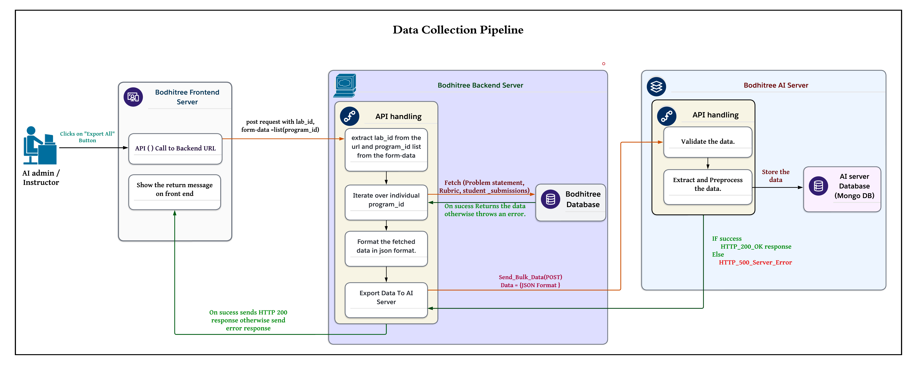
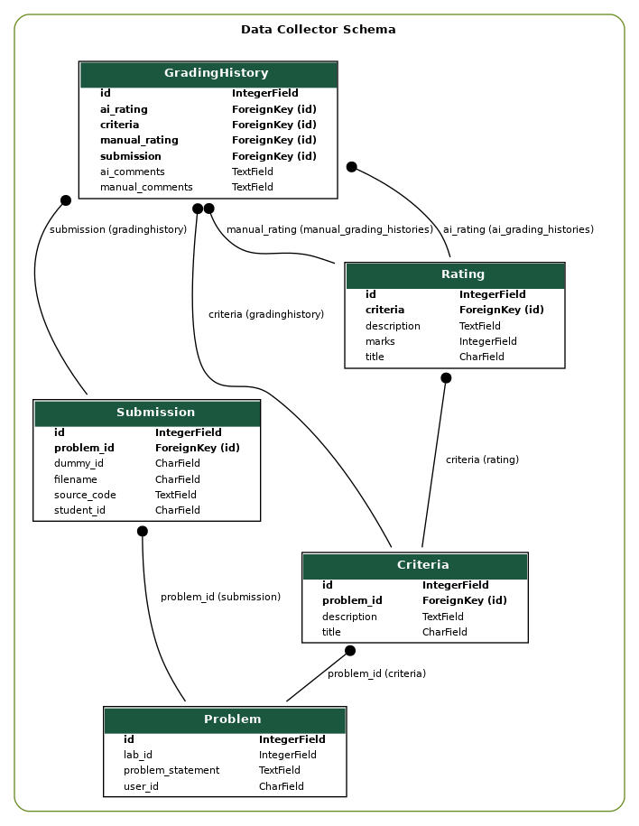

# Data Collector

The Data Collector Pipeline is designed to gather and store essential data from the BodhiTree interface, which is crucial for enhancing the AI model used for grading. The collected data includes the problem statement, rubric, code submissions, TA Buddy grade & comment suggestions, and TA/Instructor grades and comments.


## Quick Start 

### Pre-Requisite

1. **Install Python on your machine.**  
   Ensure that Python (preferably Python 3.x) is installed on your system. You can download it from the official [Python website](https://www.python.org/downloads/).

2. **Install project dependencies.**  
   Run the following command to install all the required Python packages listed in the `requirements.txt` file:
   ```bash
   pip install -r requirements.txt
   ```

3. **Start the MongoDB server.**  
   Use Docker to run the MongoDB server by executing the following command:
   ```bash
   docker-compose up -d
   ```

4. **Make database migrations.**  
   Create the necessary migrations for your Django models:
   ```bash
   python3 manage.py makemigrations
   ```

5. **Apply the migrations to the database.**  
   Run the migrations to set up the database schema:
   ```bash
   python3 manage.py migrate
   ```

6. **Start the Django development server.**  
   Finally, start the Django server using:
   ```bash
   python3 manage.py runserver
   ```

Now your Django application should be up and running!


### Overview

The data collection process follows the flow illustrated in the diagram below:



### Workflow Description

#### 1. BodhiTree Server Front-End Workflow

**User Action:**
- **Step 1:** The user clicks the “Export Data” button on the submission page.
- **Step 2:** The front-end sends a POST request to the backend URL `evalpro/rubric/exportData/{labId}`.
- **Step 3:** The request contains form data with a list of program IDs.

#### 2. BodhiTree Server Back-End Workflow

**Request Handling:**
- **Step 1:** The server listens for the POST request at `evalpro/rubric/exportData/{labId}`.
- **Step 2:** It extracts the `labId` from the URL and the program ID list from the form data.
- **Step 3:** For each program ID in the list:
  - First, it checks whether the data related to that program ID has already been exported by checking the value of the field `is_data_exported` in the `AIHistory` model for that program ID.
  - If data is not already exported:
    - Fetch the associated Problem Statement.
    - Fetch the Rubrics.
    - Fetch the Submission.
    - Fetch the Manual Grading History.
    - Fetch the AI Grading History.
  - If data is already exported, an error message "Data already exported" is shown in the frontend.
- **Step 4:** Construct a well-formatted JSON structure containing the Problem Statement, Rubrics, Submission for each program ID, and AI Grading and Manual Grading history for each student.
- **Step 5:** Send the JSON data to the AI Server via a POST request.
- **Step 6:** After receiving a response from the AI Server, return a success message to the frontend.

#### 3. AI Server Workflow

**Data Processing:**
- **Step 1:** The AI Server listens on port 27017 for incoming POST requests.
- **Step 2:** Upon receiving the request, validate the JSON structure to ensure it conforms to the expected format.
- **Step 3:** Extract and process the data from the JSON, molding it into a storage-efficient format.
- **Step 4:** Send an HTTP 200 (OK) status code back to the BodhiTree Server as a response.
- **Step 5:** Store the processed data.

### Structure of Data to Send To AI-Server

This is the format of data which is expected to be generated from the BodhiTree backend and sent to the AI Server within an API call:

```json
{
  "course_id": {
    "lab_id": {
      "program_id": {
        "problem_statement": "Problem Statement",
        "file_name": "a.cpp",
        "rubric": [
          {
            "criterion_id": {
              "title": "criterion_title",
              "description": "",
              "ratings": {
                "rating_id": {
                  "title": "rating_title",
                  "description": "rating_description",
                  "marks": 10
                }
              }
            }
          }
        ],
        "student_submissions": {
          "23m0838": {
            "source_code": "source_code",
            "manual_rating": {
              "criterion_id": [
                "rating_id",
                "Code is clean and follows conventions. Well-commented."
              ]
            },
            "ai_rating": {
              "criterion_id": [
                "rating_id",
                "High-quality code with excellent readability."
              ]
            }
          }
        }
      }
    }
  }
}
```

### Database Schema in AI Server for Data Storage

The figure below shows the schema for storing data on the AI server. This schema helps to manage and organize data needed for training machine learning models with minimal effort.



### Generating Database Schema Using Django Inbuilt Feature

```bash
python3 manage.py graph_models -a -g -o modfied_er_diagram.dot --dot
dot -Tpng modfied_er_diagram.dot -o modified_er_diagram.png
```
